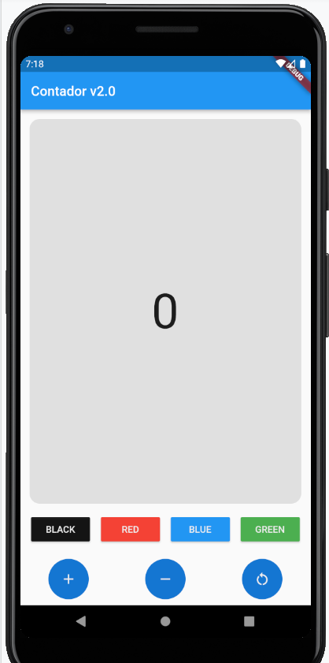
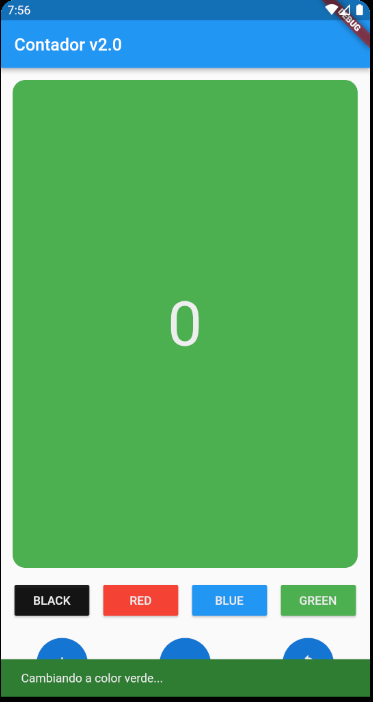
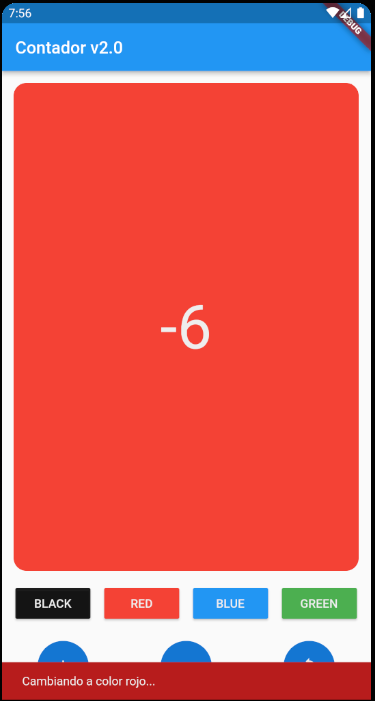
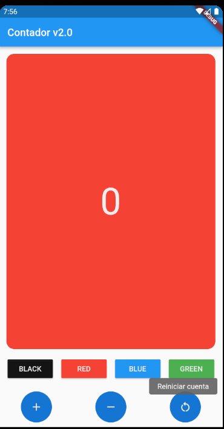

App para practicar el disenio de layouts con widgets mas comunes
containers, stacks, row/columns, text fields, etc...
- Empezar a utilizar manejo de estados en los widgets.
- Utilizar Provider.

## Getting Started

Recuerda que despues de clonar el proyecto, abrir una terminal dentro de la carpeta del proyecto y ejecutar el comando:

```sh
flutter packages get
``` 

## App Screenshot






